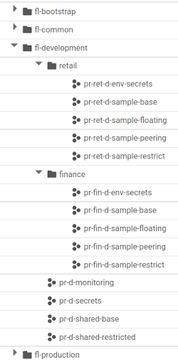

# Guidance for modifications of resource hierarchy

Explains the instructions to change resource hierarchy during Terraform Foundation Example blueprint deployment.

The current deployment scenario of Terraform Foundation Example blueprint considers a flat resource hierarchy having one folder for each environment.

This document covers two additional scenarios:

- Environment folders as root of folders hierarchy
- Environment folders as leaf of folders hierarchy

<table>
<thead>
<tr >
<th style="text-align: center;">
Current Scenario
</th>
<th style="text-align: center;">
Environment folders as root
</th>
<th style="text-align: center;">
Environment folders as leaf
</th>
</tr>
</thead>
<tbody>
<tr>
<td style="font-family: monospace;">
example-organization/<br>
├── fldr-bootstrap<br>
├── fldr-common<br>
├── <b>fldr-development</b><br>
├── <b>fldr-non-production</b><br>
└── <b>fldr-production</b><br>
</td>
<td style="font-family: monospace;">
example-organization/<br>
├── fldr-bootstrap<br>
├── fldr-common<br>
└── <b>fldr-development</b><br>
&nbsp;&nbsp;&nbsp;&nbsp;├── finance<br>
&nbsp;&nbsp;&nbsp;&nbsp;└── retail<br>
└── <b>fldr-non-production</b><br>
&nbsp;&nbsp;&nbsp;&nbsp;├── finance<br>
&nbsp;&nbsp;&nbsp;&nbsp;└── retail<br>
└── <b>fldr-production</b><br>
&nbsp;&nbsp;&nbsp;&nbsp;├── finance<br>
&nbsp;&nbsp;&nbsp;&nbsp;└── retail<br>
</td>
<td style="font-family: monospace;">
example-organization/<br>
├── fldr-bootstrap<br>
├── fldr-common<br>
└── finance</b><br>
&nbsp;&nbsp;&nbsp;&nbsp;├── <b>fldr-development</b><br>
&nbsp;&nbsp;&nbsp;&nbsp;├── <b>fldr-non-production</b><br>
&nbsp;&nbsp;&nbsp;&nbsp;└── <b>fldr-production</b><br>
└── retail</b><br>
&nbsp;&nbsp;&nbsp;&nbsp;├── <b>fldr-development</b><br>
&nbsp;&nbsp;&nbsp;&nbsp;├── <b>fldr-non-production</b><br>
&nbsp;&nbsp;&nbsp;&nbsp;└── <b>fldr-production</b><br>
</td>
</tr>
</tbody>
</table>

## Code Changes - Both Scenarios

### Build Files

Review tf-wrapper.sh.

1. Create a new variable maxdepth to set how many source folder levels should be searched for terraform configurations.

    ```bash
    ...
    tmp_plan="${base_dir}/tmp_plan" #if you change this, update build triggers
    environments_regex="^(development|non-production|production|shared)$"

    # Create maxdepth variable
    maxdepth=2

    ## Terraform apply for single environment.
    tf_apply() {
    ...
    ```

1. Change find commands to use maxdepth variable on all terraform commands. Make sure you do the same changes in functions:

## Code Changes - Hierarchy creation - Environments as Root

```text
└── development
    └── finance
    └── retail
└── non-production
    └── finance
    └── retail
└── production
    └── finance
    └── retail
```



*Figure 1 - An example of environments as root folders*

### Step 2-environments

1. Create the folder hierarchy for the business units in each environment.

    Example:

    2-environments/envs/development/main.tf

    ```hcl
    module "env" {
        source = "../../modules/env_baseline"

        env = "development"
        ...
    }

    /* Folder hierarchy creation */
    resource "google_folder" "finance" {
        display_name = "finance"
        parent       = module.env.env_folder
    }

    resource "google_folder" "retail" {
        display_name = "retail"
        parent       = module.env.env_folder
    }
    ```

1. Create an output with the flat representation of the new hierarchy in each environment. It will be used by next steps to host GCP projects.

    *Table 1 - Example output for Figure 1 resource hierarchy*

    | Folder Path | Folder Id |
    | --- | --- |
    | development | folders/0000000 |
    | development/finance | folders/11111111 |
    | development/retail | folders/2222222 |
